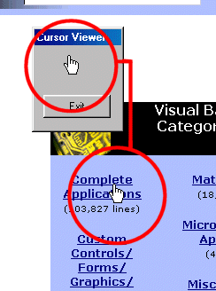

<div align="center">

## Display Current Mouse Pointer Image


</div>

### Description

This code displays a picture of the current mouse pointer in a PictureBox control. This could be useful for doing screen captures that include the mouse pointer.
 
### More Info
 
Create a Form (frmMain), a PictureBox (picCursor), a Timer (tmrCursor), and a Command Button (cmdExit). Set tmrCursor's interval to 10.

It seems to prevent double-clicking.


<span>             |<span>
---                |---
**Submitted On**   |
**By**             |[Will Brendel](https://github.com/Planet-Source-Code/PSCIndex/blob/master/ByAuthor/will-brendel.md)
**Level**          |Intermediate
**User Rating**    |4.2 (21 globes from 5 users)
**Compatibility**  |VB 5\.0, VB 6\.0
**Category**       |[Miscellaneous](https://github.com/Planet-Source-Code/PSCIndex/blob/master/ByCategory/miscellaneous__1-1.md)
**World**          |[Visual Basic](https://github.com/Planet-Source-Code/PSCIndex/blob/master/ByWorld/visual-basic.md)
**Archive File**   |[](https://github.com/Planet-Source-Code/will-brendel-display-current-mouse-pointer-image__1-8252/archive/master.zip)

### API Declarations

```
' Get the handle of the window the mouse is over
Private Declare Function WindowFromPoint Lib "user32" (ByVal xPoint As Long, ByVal yPoint As Long) As Long
' Retrieves the handle of the current cursor
Private Declare Function GetCursor Lib "user32" () As Long
' Gets the coordinates of the mouse pointer
Private Declare Function GetCursorPos Lib "user32" (lpPoint As POINTAPI) As Long
' Gets the PID of the window specified
Private Declare Function GetWindowThreadProcessId Lib "user32" (ByVal hWnd As Long, lpdwProcessId As Long) As Long
' Gets the PID of the current program
Private Declare Function GetCurrentThreadId Lib "kernel32" () As Long
' This attaches our program to whichever thread "owns" the cursor at the moment
Private Declare Function AttachThreadInput Lib "user32" (ByVal idAttach As Long, ByVal idAttachTo As Long, ByVal fAttach As Long) As Long
' The next function draws the cursor to picCursor
' Note: If you want to display it in an Image control, use the GetDc API call
Private Declare Function DrawIcon Lib "user32" (ByVal hdc As Long, ByVal x As Long, ByVal y As Long, ByVal hIcon As Long) As Long
' The POINTAPI type hold the (X,Y) for GetCursorPos()
Private Type POINTAPI
  x As Long
  y As Long
End Type
' The following are used for keeping the window always on top. This is optional.
Private Declare Function SetWindowPos Lib "user32" (ByVal hWnd As Long, ByVal hWndInsertAfter As Long, ByVal x As Long, ByVal y As Long, ByVal cx As Long, ByVal cy As Long, ByVal wFlags As Long) As Long
Private Const SWP_TOPMOST = -1
Private Const SWP_NOTOPMOST = -2
```


### Source Code

```
' The is the function to set a form always on top
Private Sub OnTop(frm As Form, OnTop As Boolean)
  If OnTop = True Then
   SetWindowPos frm.hWnd, SWP_TOPMOST, 0, 0, 0, 0, &H1
  Else
   SetWindowPos frm.hWnd, SWP_NOTOPMOST, 0, 0, 0, 0, &H1
  End If
End Sub
' Paints the cursor image to the picturebox
Private Sub PaintCursor()
 Dim pt As POINTAPI
 Dim hWnd As Long
 Dim dwThreadID, dwCurrentThreadID As Long
 Dim hCursor
 ' Get the position of the cursor
 GetCursorPos pt
 ' Then get the handle of the window the cursor is over
 hWnd = WindowFromPoint(pt.x, pt.y)
 ' Get the PID of the thread
 ThreadID = GetWindowThreadProcessId(hWnd, vbNull)
 ' Get the thread of our program
 CurrentThreadID = App.ThreadID
 ' If the cursor is "owned" by a thread other than ours, attach to that thread and get the cursor
 If CurrentThreadID <> ThreadID Then
  AttachThreadInput CurrentThreadID, ThreadID, True
  hCursor = GetCursor()
  AttachThreadInput CurrentThreadID, ThreadID, False
 ' If the cursor is owned by our thread, use GetCursor() normally
 Else
  hCursor = GetCursor()
 End If
 ' Use DrawIcon to draw the cursor to picCursor
 DrawIcon picCursor.hdc, 0, 0, hCursor
End Sub
Private Sub cmdExit_Click()
 ' Cleanup
 tmrCursor.Enabled = False
 OnTop frmMain, False
 ' Exit
 End
End Sub
Private Sub Form_Load()
 ' Make the form always on top
 OnTop frmMain, True
 ' Move frmMain to the upper-left corner of the screen
 frmMain.Move 0, 0
End Sub
Private Sub tmrCursor_Timer()
 ' Clear the picturebox before drawing another cursor image
 picCursor.Cls
 ' Draw the cursor
 PaintCursor
End Sub
```

